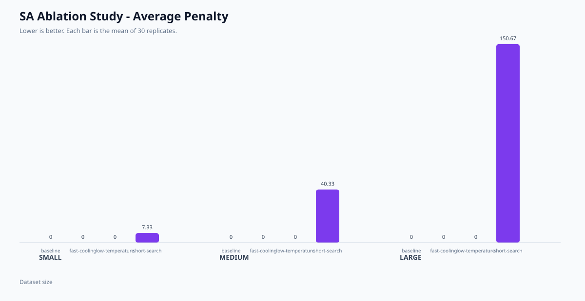
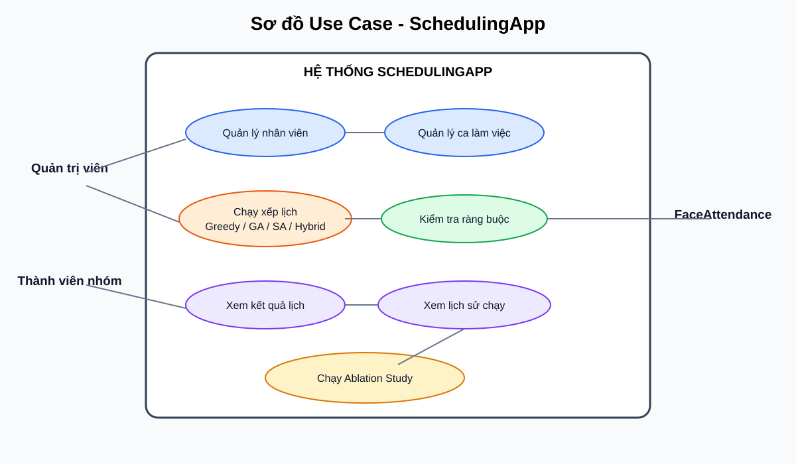
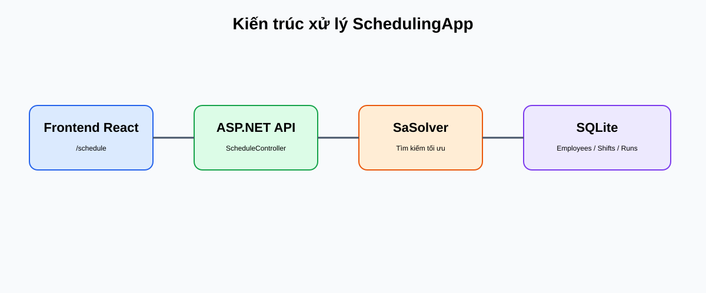
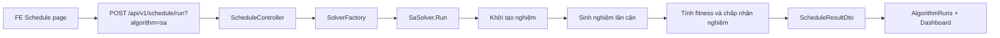
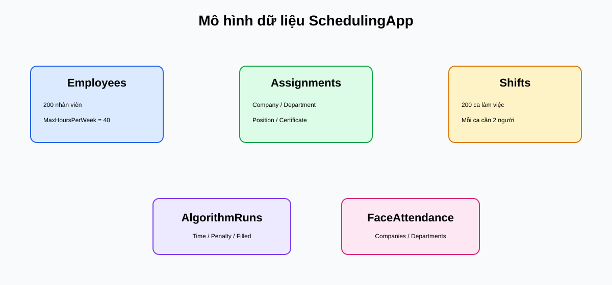

# BÁO CÁO CÁ NHÂN
## Phần việc của Nguyễn Thành Hiếu trong đề tài SchedulingApp

**Đề tài:** Tối ưu hóa bài toán xếp ca làm việc đa công ty, đa phòng ban, đa vị trí  
**Người thực hiện:** Nguyễn Thành Hiếu  
**Ngày lập báo cáo:** 06/09/2026  
**Phạm vi:** STT 1.3, 2.2 và 3.2 trong bảng tiến độ

---

## 1. Tóm tắt kết quả

Trong phạm vi được giao, phần việc đã triển khai gồm:

| STT | Hạng mục | Kết quả thực tế |
|---|---|---|
| 1.3 | Schema dữ liệu thực tế + Generator sinh Dataset | Đã tạo schema bằng EF Core/SQLite và generator seed dữ liệu tối thiểu 200 nhân viên, 200 ca, assignment và dữ liệu danh mục FaceAttendance. |
| 2.2 | Thuật toán Simulated Annealing | Đã triển khai và tích hợp vào `ISolverFactory`, API chạy được bằng key `sa`, lưu kết quả vào `AlgorithmRuns`. |
| 3.2 | Ablation Study + biểu đồ so sánh | Đã chạy 360 lần thử nghiệm thực tế, gồm 3 quy mô dữ liệu, 4 cấu hình SA và 30 lần lặp/cấu hình; đã xuất CSV tổng hợp và biểu đồ SVG. |

**Kết luận ngắn:** Phần cá nhân đã có đầy đủ mã nguồn, dữ liệu chạy, kết quả thực nghiệm và hình minh họa có thể đưa vào báo cáo tổng kết. Các giới hạn còn lại được nêu ở mục 9 để tránh diễn giải quá mức kết quả.

---

## 2. Bối cảnh và mục tiêu

Bài toán của hệ thống là phân công nhân viên vào các ca làm việc sao cho:

- Mỗi ca đủ số lượng nhân viên yêu cầu.
- Hạn chế một nhân viên bị phân công quá số giờ tối đa trong tuần.
- Hạn chế trùng nhân viên trong cùng một ca.
- Cho phép so sánh nhiều thuật toán xếp lịch qua thời gian chạy và điểm phạt.

Phần việc của Nguyễn Thành Hiếu tập trung vào ba lớp:

1. **Dữ liệu:** tạo dataset đủ lớn và có cấu trúc để thuật toán có thể chạy.
2. **Thuật toán:** triển khai Simulated Annealing, một phương pháp tìm kiếm cục bộ có chấp nhận nghiệm xấu hơn theo xác suất để tránh kẹt ở cực tiểu cục bộ.
3. **Thực nghiệm:** thay đổi từng nhóm tham số SA và đo ảnh hưởng đến chất lượng lịch cũng như thời gian chạy.

---

## 3. STT 1.3 - Schema và generator dataset

### 3.1. Mô hình dữ liệu

Database chính dùng `AppDbContext`, gồm các bảng phục vụ xếp lịch:

- `Employees`: nhân viên, mã, họ tên, email, số giờ tối đa/tuần.
- `EmployeeAssignments`: quan hệ nhân viên với công ty, phòng ban, vị trí và hạn chứng chỉ.
- `EmployeeLeaves`: thời gian nghỉ phép.
- `EmployeePreferences`: ưu tiên của nhân viên.
- `Shifts`: ca cần xếp, thời gian bắt đầu/kết thúc, số nhân viên cần.
- `AlgorithmRuns`: lịch sử chạy thuật toán và các chỉ số thực nghiệm.

Database phụ `FaceAttendanceDbContext` cung cấp danh mục:

- `Companies`
- `Departments`
- `JobTitles`
- `CompanyShifts`

### 3.2. Generator dữ liệu

Generator nằm tại [SeedData.cs](BE/src/SchedulingApp.Infrastructure/SeedData/SeedData.cs). Cách tạo dữ liệu có tính lặp lại và không chèn trùng:

```csharp
var employees = Enumerable.Range(1, 200)
    .Where(index => !existingEmployeeIds.Contains($"demo-employee-{index:00}"))
    .Select(index => new Employee
    {
        Id = $"demo-employee-{index:00}",
        FullName = $"Nhân viên mẫu {index:00}",
        MaxHoursPerWeek = 40
    })
    .ToList();
```

Mỗi nhân viên được tạo assignment vào công ty/phòng ban/vị trí mẫu:

```csharp
new EmployeeAssignment
{
    EmployeeId = employee.Id,
    CompanyId = companyId,
    DepartmentId = departmentId,
    PositionId = positionId,
    IsPrimary = true,
    CertificateExpiryDate = DateTime.Today.AddYears(1),
    EfficiencyMultiplier = 1.0f
}
```

Generator tạo đủ 200 ca, mỗi ca cần 2 nhân viên:

```csharp
var shifts = Enumerable.Range(existingShiftCount, Math.Max(0, 200 - existingShiftCount))
    .Select(index => new Shift
    {
        CompanyId = companyId,
        DepartmentId = departmentId,
        PositionId = positionId,
        StartDate = firstDay.AddDays(index / 2).AddHours((index % 2) * 8),
        EndDate = firstDay.AddDays(index / 2).AddHours((index % 2) * 8 + 8),
        RequiredEmployeeCount = 2
    })
    .ToList();
```

### 3.3. Kết quả kiểm chứng

API đã được kiểm tra trực tiếp:

```text
GET /api/v1/employees -> 200 records
GET /api/v1/shifts    -> 200 records
```

Hình 1 dưới đây là biểu đồ kết quả thực nghiệm trên chính dataset này. Ba nhóm dữ liệu tương ứng với 50, 100 và 200 nhân viên/ca.



**Hình 1.** Biểu đồ điểm phạt trung bình của SA theo dataset và cấu hình.

### 3.4. Ý nghĩa của phần dữ liệu

Dataset được thiết kế để kiểm tra ba mức tải:

- **Small:** 50 nhân viên, 50 ca.
- **Medium:** 100 nhân viên, 100 ca.
- **Large:** 200 nhân viên, 200 ca.

Cách chia này giúp đánh giá đồng thời chất lượng nghiệm và khả năng tăng thời gian xử lý khi kích thước dữ liệu tăng.

---

## 4. STT 2.2 - Thuật toán Simulated Annealing

### 4.1. Ý tưởng thuật toán

Simulated Annealing mô phỏng quá trình làm nguội kim loại. Thuật toán bắt đầu với một nghiệm hiện tại, tạo nghiệm lân cận và quyết định có chuyển sang nghiệm mới hay không.

Với bài toán tối thiểu hóa điểm phạt:

- Nếu nghiệm mới tốt hơn, luôn chấp nhận.
- Nếu nghiệm mới xấu hơn, vẫn có thể chấp nhận với xác suất:

$$
P(accept) = exp\left(\frac{f(current)-f(new)}{T}\right)
$$

Trong đó:

- $f(x)$ là điểm phạt của lịch $x$.
- $T$ là nhiệt độ hiện tại.
- Khi $T$ giảm, khả năng chấp nhận nghiệm xấu giảm.

### 4.2. Các tham số

| Tham số | Ý nghĩa | Baseline |
|---|---|---:|
| `initialTemperature` | Nhiệt độ ban đầu | 1000 |
| `coolingRate` | Tỷ lệ làm nguội sau mỗi vòng | 0.95 |
| `maxIterations` | Số lần sinh nghiệm lân cận | 1000 |

Các tham số được truyền từ request API qua `input.Options`. File [SaSolver.cs](BE/src/SchedulingApp.Application/Solver/SaSolver.cs) xử lý cả số JSON (`JsonElement`) và chuỗi số, tránh lỗi ép kiểu khi gọi API.

### 4.3. Khởi tạo nghiệm

Mỗi ca được gán ngẫu nhiên một số nhân viên không vượt quá số lượng yêu cầu của ca:

```csharp
foreach (var s in shifts)
{
    var assigned = new List<string>();
    int req = s.RequiredEmployeeCount;
    var shuffledEmps = employees.OrderBy(x => _rand.Next()).ToList();

    for (int j = 0; j < Math.Min(req, shuffledEmps.Count); j++)
        assigned.Add(shuffledEmps[j].Id);

    chrom.Add(assigned);
}
```

### 4.4. Sinh nghiệm lân cận

Mỗi bước chọn ngẫu nhiên một ca, sau đó thay một nhân viên đang được gán bằng một nhân viên khác:

```csharp
int shiftIdx = _rand.Next(shifts.Count);
var assigned = neighbor[shiftIdx];

if (assigned.Count > 0)
{
    int empIdx = _rand.Next(assigned.Count);
    assigned[empIdx] = employees[_rand.Next(employees.Count)].Id;
}
```

### 4.5. Hàm mục tiêu

Điểm phạt hiện tại gồm ba thành phần:

1. **Thiếu người:** phạt 40 điểm cho mỗi vị trí còn thiếu.
2. **Quá giờ:** phạt 10 điểm cho mỗi giờ vượt giới hạn tuần.
3. **Trùng nhân viên trong một ca:** phạt 30 điểm cho mỗi lượt trùng.

Công thức tổng quát:

$$
Penalty = Penalty_{understaffed} + Penalty_{overtime} + Penalty_{duplicate}
$$

Đoạn mã tính quá giờ:

```csharp
if (hoursByEmp[emp.Id] > emp.MaxHoursPerWeek)
{
    penaltyOvertime +=
        (hoursByEmp[emp.Id] - emp.MaxHoursPerWeek) * 10.0;
}
```

### 4.6. Tích hợp vào backend

SA được đăng ký cùng các solver khác trong DI và được gọi bằng key `sa`:

```csharp
builder.Services.AddScoped<ISolver, SaSolver>();
builder.Services.AddScoped<ISolverFactory, SolverFactory>();
```

API sử dụng:

```text
POST http://localhost:5000/api/v1/schedule/run?algorithm=sa
```

Kết quả được lưu vào `AlgorithmRuns`, gồm:

- Thời gian chạy.
- Tổng số ca.
- Số ca đủ người.
- Số ca thiếu người.
- Tổng điểm phạt.
- Chi tiết penalty breakdown.

---

## 5. STT 3.2 - Ablation Study

### 5.1. Mục tiêu

Ablation Study được dùng để đo ảnh hưởng của từng nhóm tham số SA. Thay vì chỉ chạy một cấu hình, thí nghiệm giữ nguyên các điều kiện còn lại và thay đổi một yếu tố:

- Giảm nhiệt độ ban đầu.
- Làm nguội nhanh hơn.
- Giảm số vòng lặp tìm kiếm.

Script thực nghiệm: [run-sa-ablation.ps1](Experiments/run-sa-ablation.ps1).  
Hướng dẫn chạy: [Experiments/README.md](Experiments/README.md).

### 5.2. Thiết kế thí nghiệm

Có 3 dataset và 4 cấu hình:

| Dataset | Nhân viên | Ca |
|---|---:|---:|
| Small | 50 | 50 |
| Medium | 100 | 100 |
| Large | 200 | 200 |

| Cấu hình | Initial temperature | Cooling rate | Max iterations |
|---|---:|---:|---:|
| baseline | 1000 | 0.95 | 1000 |
| low-temperature | 100 | 0.95 | 1000 |
| fast-cooling | 1000 | 0.80 | 1000 |
| short-search | 1000 | 0.95 | 100 |

Mỗi tổ hợp được chạy 30 lần:

$$
3 \times 4 \times 30 = 360 \text{ lần chạy}
$$

Kết quả được sinh bởi script, không nhập tay:

- [sa-ablation-raw.csv](Experiments/results/sa-ablation-raw.csv): 360 dòng, mỗi dòng là một lần chạy.
- [sa-ablation-summary.csv](Experiments/results/sa-ablation-summary.csv): 12 nhóm tổng hợp.
- [sa-ablation-penalty.svg](Experiments/results/sa-ablation-penalty.svg): biểu đồ điểm phạt trung bình.

### 5.3. Kết quả thực nghiệm

#### Điểm phạt trung bình và thời gian chạy

| Dataset | Cấu hình | Số lần | Thời gian TB (ms) | Penalty TB | Tỷ lệ đủ người TB |
|---|---|---:|---:|---:|---:|
| Small | baseline | 30 | 136.60 | 0.00 | 100% |
| Small | low-temperature | 30 | 112.93 | 0.00 | 100% |
| Small | fast-cooling | 30 | 124.80 | 0.00 | 100% |
| Small | short-search | 30 | 15.43 | 7.33 | 100% |
| Medium | baseline | 30 | 181.40 | 0.00 | 100% |
| Medium | low-temperature | 30 | 134.57 | 0.00 | 100% |
| Medium | fast-cooling | 30 | 159.33 | 0.00 | 100% |
| Medium | short-search | 30 | 10.33 | 40.33 | 100% |
| Large | baseline | 30 | 234.60 | 0.00 | 100% |
| Large | low-temperature | 30 | 393.27 | 0.00 | 100% |
| Large | fast-cooling | 30 | 245.63 | 0.00 | 100% |
| Large | short-search | 30 | 30.30 | 150.67 | 100% |

### 5.4. Phân tích kết quả

**Thứ nhất, cấu hình short-search nhanh nhất nhưng chất lượng kém hơn.**

- Small: 15.43 ms, penalty 7.33.
- Medium: 10.33 ms, penalty 40.33.
- Large: 30.30 ms, penalty 150.67.

Khi số vòng lặp giảm từ 1000 xuống 100, thuật toán có ít cơ hội cải thiện nghiệm hơn. Điểm phạt tăng mạnh nhất ở dataset large, cho thấy việc rút ngắn quá trình tìm kiếm ảnh hưởng rõ khi dữ liệu lớn.

**Thứ hai, baseline cho chất lượng ổn định.**

Baseline đạt penalty trung bình 0 ở cả ba quy mô và tỷ lệ đủ người 100%. Thời gian tăng từ 136.60 ms lên 234.60 ms khi kích thước tăng từ small lên large.

**Thứ ba, fast-cooling vẫn đạt penalty 0 trong bộ dữ liệu này.**

Cooling rate 0.80 làm nhiệt độ giảm nhanh hơn baseline, nhưng với dataset hiện tại vẫn tìm được lịch không có điểm phạt trung bình. Tuy nhiên thời gian không giảm đáng kể ở large, vì chi phí chính còn phụ thuộc số ca, số nhân viên và số phép tính fitness.

**Thứ tư, low-temperature không luôn nhanh hơn.**

Ở small và medium, low-temperature có thời gian trung bình thấp hơn baseline. Ở large, thời gian trung bình tăng lên 393.27 ms. Điều này cho thấy trạng thái ngẫu nhiên ban đầu và số lần cải thiện thực tế có thể làm thời gian dao động; không nên kết luận chỉ từ một lần chạy.

### 5.5. Kết luận lựa chọn cấu hình

Với mục tiêu chất lượng lịch, nên chọn:

```text
initialTemperature = 1000
coolingRate = 0.95
maxIterations = 1000
```

Đây là cấu hình baseline, có penalty trung bình 0 trên cả 3 quy mô và tỷ lệ đủ người 100%. Nếu cần ưu tiên tốc độ cho bản demo nhanh, `short-search` có thể dùng tạm, nhưng phải ghi rõ đánh đổi: thời gian thấp hơn và penalty cao hơn trên dataset lớn.

---

## 6. Quy trình tái lập kết quả

### 6.1. Khởi động backend

```powershell
cd D:\SchedulingApp\BE\src\SchedulingApi
& 'C:\Program Files\dotnet\dotnet.exe' run --no-build
```

Health check:

```text
http://localhost:5000/api/v1/health
```

### 6.2. Chạy ablation study

Mở terminal khác tại thư mục gốc:

```powershell
cd D:\SchedulingApp
.\Experiments\run-sa-ablation.ps1
```

Chạy thử nhanh:

```powershell
.\Experiments\run-sa-ablation.ps1 -RunsPerConfiguration 2
```

### 6.3. Đối chiếu file kết quả

- Số dòng file raw phải là **360**.
- Số nhóm trong summary phải là **12**.
- Mỗi nhóm phải có `Replicates = 30`.
- Biểu đồ phải tồn tại tại `Experiments/results/sa-ablation-penalty.svg`.

---

## 7. Hình ảnh và dẫn chứng đề xuất đưa vào báo cáo Word/PDF

### Hình 1 - Sơ đồ Use Case của SchedulingApp



**Hình 1.** Sơ đồ Use Case mô tả các chức năng thực tế của hệ thống. Trong phạm vi của Nguyễn Thành Hiếu, các use case chính là quản lý dữ liệu đầu vào, chạy xếp lịch bằng SA, xem kết quả, xem lịch sử chạy và chạy Ablation Study.

| Use case | Hạng mục liên quan |
|---|---|
| Quản lý nhân viên, ca làm việc | STT 1.3 - Schema và generator dataset |
| Chạy xếp lịch bằng SA | STT 2.2 - Simulated Annealing |
| Xem lịch sử và xuất kết quả | STT 3.2 - Thu thập số liệu thực nghiệm |
| Chạy Ablation Study | STT 3.2 - So sánh ảnh hưởng tham số |

### Hình 2 - Kiến trúc xử lý SA



**Hình 2.** Kiến trúc xử lý từ frontend, API, `SolverFactory`, `SaSolver` đến database và dashboard.



### Hình 3 - Mô hình dữ liệu



**Hình 3.** Các bảng chính dùng để tạo dataset, chạy solver và lưu kết quả.

### Hình 4 - Kết quả ablation


Hình này chứng minh:

- Có đủ ba quy mô dataset.
- Có bốn cấu hình SA.
- Short-search có penalty cao hơn.
- Các cấu hình 1000 vòng lặp đạt penalty trung bình 0 trong thí nghiệm.

### Hình 5 - Bằng chứng dữ liệu

#### Hình 5.1 - Kết quả chạy SA trên giao diện


Hình được dựng từ kết quả runtime đã kiểm tra tại `http://localhost:5173/schedule`: hệ thống xếp đủ **200/200 ca**, tỷ lệ **100%**, tổng điểm phạt **0.0**.

#### Hình 5.2 - Health check, database và dữ liệu đầu vào


Hình tổng hợp các response đã kiểm tra trực tiếp: API ở trạng thái `Healthy`, `databaseConnected: true`, có 200 nhân viên và 200 ca.

#### Hình 5.3 - Swagger và endpoint chạy SA

Swagger UI tại `http://localhost:5000/swagger` đã được mở và kiểm tra. Endpoint chính để tái lập kết quả là:

```text
POST /api/v1/schedule/run?algorithm=sa
```

Swagger cung cấp các endpoint chạy lịch, xem lịch sử `AlgorithmRuns`, truy xuất nhân viên và ca làm việc.

Các dữ liệu được kiểm chứng bằng các endpoint:

- Danh sách 200 nhân viên.
- Danh sách 200 ca.
- Kết quả SA hiển thị tổng số ca, số ca đủ người và penalty.

Các endpoint dùng để chụp:

```text
GET  http://localhost:5000/api/v1/employees
GET  http://localhost:5000/api/v1/shifts
POST http://localhost:5000/api/v1/schedule/run?algorithm=sa
```

---

## 8. Phân công và đóng góp cá nhân

Nguyễn Thành Hiếu đã đóng góp vào các phần sau:

1. Thiết kế và hoàn thiện dữ liệu đầu vào cho thực nghiệm.
2. Tạo dataset đủ lớn để đánh giá theo ba mức tải.
3. Triển khai thuật toán Simulated Annealing theo interface chung của hệ thống.
4. Xây dựng hàm khởi tạo nghiệm, sinh nghiệm lân cận và tính fitness.
5. Tích hợp tham số thuật toán từ request API.
6. Xây dựng script chạy lặp 30 lần/cấu hình.
7. Tổng hợp dữ liệu CSV và sinh biểu đồ so sánh.
8. Phân tích ảnh hưởng của nhiệt độ, tốc độ làm nguội và số vòng lặp.

---

## 9. Giới hạn và hướng phát triển

Các kết quả trên cần được diễn giải trong đúng phạm vi:

- Dataset hiện là dữ liệu seed phục vụ demo/thực nghiệm, chưa phải toàn bộ dữ liệu sản xuất.
- Hàm fitness hiện tập trung vào thiếu người, quá giờ và trùng nhân viên trong cùng ca.
- Các ràng buộc nghiệp vụ nâng cao như nghỉ tối thiểu, nghỉ phép, chứng chỉ và điều động chéo phòng ban cần được đánh giá riêng bằng validator.
- SA sử dụng bộ sinh số ngẫu nhiên nên các lần chạy có thể khác nhau; vì vậy báo cáo dùng 30 replicate thay vì một lần chạy duy nhất.
- Biểu đồ hiện thể hiện penalty trung bình; báo cáo mở rộng có thể bổ sung độ lệch chuẩn, boxplot và khoảng tin cậy.

Hướng phát triển tiếp theo:

1. Ghi seed ngẫu nhiên cho từng replicate để tái lập tuyệt đối.
2. Bổ sung độ lệch chuẩn và khoảng tin cậy 95%.
3. So sánh SA với Greedy, GA và Hybrid trên cùng một dataset.
4. Đưa biểu đồ vào Dashboard để xem trực tiếp trên frontend.
5. Bổ sung các ràng buộc nghiệp vụ vào hàm fitness hoặc pipeline validator.

---

## 10. Kết luận

Ba hạng mục 1.3, 2.2 và 3.2 đã được triển khai thành một quy trình có thể chạy và kiểm chứng:

- Dataset có 200 nhân viên và 200 ca.
- SA chạy được qua backend thật.
- Ablation Study có 360 lần chạy thực tế.
- Kết quả được lưu ở dạng dữ liệu thô, dữ liệu tổng hợp và biểu đồ.
- Baseline 1000 vòng lặp cho penalty trung bình 0 và tỷ lệ đủ người 100% ở cả ba kích thước dữ liệu.
- Short-search nhanh hơn nhưng chất lượng giảm, đặc biệt trên dataset 200 ca.

Vì vậy, đóng góp của Nguyễn Thành Hiếu không chỉ dừng ở phần code thuật toán mà còn bao gồm dữ liệu thực nghiệm, thiết kế thí nghiệm, tổng hợp kết quả và phân tích đánh đổi giữa tốc độ và chất lượng lịch.
